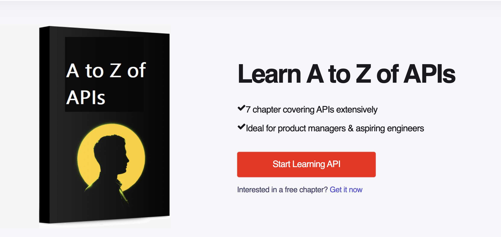
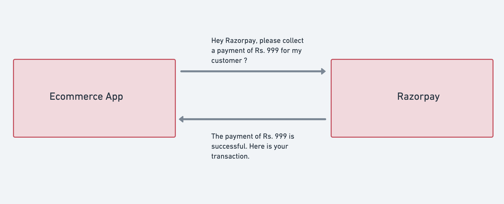
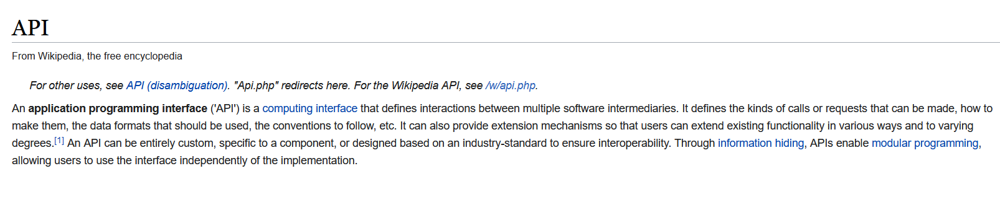
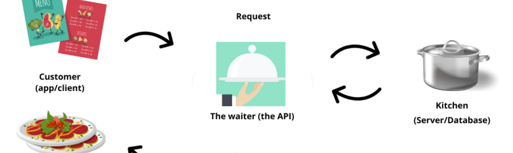
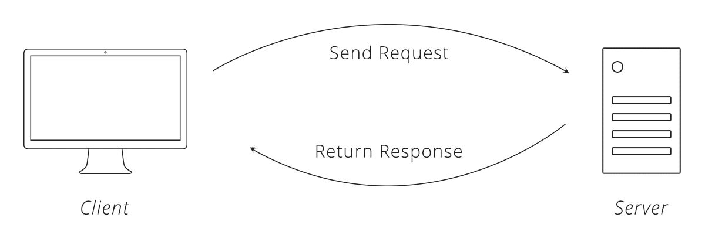

If you are college student or working professional, aspiring to get into tech or want to upskill yourself. API is one of most important skill to learn about. 

Why ? Because in the age of cloud computing most of application feature depends on an APIs whether it is inhouse or 3rd Party API. 


<a href="https://learn.apiforpm.tech/module-1">

</a>


## 1. Why do we need APIs ?
---

*There is a joke that goes around in the product circle  - If a Product Manager knows APIs, then we know that they understand technology.*

In this course, we will learn what an API is? We will also deep dive into:-

1. Why do we even need APIs in the first instance?
2. What exactly do we mean by an API?
3. What is request-response cycle?
4. How to read an API documentation? What are end-points & query parameters?
5. What are the various error codes in API handling?
6. How can we secure APIs? What is Oauth?

*And a lot many other things!*

---

Let's take an example. Suppose you are building an e-commerce app like Amazon. *(Oh! common, I mean you can easily build an e-commerce website. There's no rocket science)*

So, when your customer selects an item to buy; she is then landed on the checkout page. What's next? You would want to collect payments. Now, building a system to collect payments is indeed a cumbersome task because you need a lot of tech efforts and compliance adherence from the government, RBI, and banks. *Which you would obviously not want to do.*

Instead, you find that Razorpay can do that on your behalf *(that is collecting payments from your customers).* You are excited but there are still a couple of problems.

- Your e-commerce platform is one system and Razorpay is another system. **How do you connect two systems so that they can communicate with one another?**

- One step further, Razorpay doesn't know how much is the payment amount
should they collect? Is it 499 or 999 or something else? They expect you *(I mean your e-commerce app to give that detail)*

- Also, you would want to know one more thing. Once, Razorpay has tried collecting the payment; was it successful or not? *If it was; you can ask your warehouse team to ship it. (Yeahh!)*


## 1.1 Building an Ecommerce App

Suppose you are building a e-commerce app like Amazon, and you have a requirement of collecting payment from customer. 

When your customer selects an item to buy; he/she is then landed on to the checkout page. What's next? You would want to collect payments. Now, building a system to collect payments is indeed a cumbersome task, because you need a lot of clearance from government, RBI and provider banks, which you would obviously not want to do it.

Instead, You search on Google & find that [Razorpay](https://razorpay.com/) can do that on your behalf *(that is collecting payments from your customers).* You are excited but there are a couple of problems. 

- Your e-commerce platform is one system and Razorpay is another system. **How do you connect two systems so that they can communicate with one another ?**
- One step further, Razorpay doesn't know how much is the payment amount should they collect ? Is it 499 or 999 or something else? They expect you *(I mean your e-commerce app to give that detail)*
- Also, you would want to know one more thing. Once, Razorpay has tried collecting the payment; was it successful or not? *If it was; you can ask your warehouse team to ship it. (Yeahh!)*



Can you see that how beautifully these two systems are talking with one another? 

But the question is how are they talking to one another? They are talking to one another through a piece of code. **This piece of code through which two systems (applications) talk to one another is called as API. *Exciting, isn't it?***

## 1.1  One more beauty of APIs

*Have you noticed it?*

When both of these systems were talking to one another *(I mean your Ecommerce App & Razorpay)* they only asked each other only relevant information. 

1. Your E-commerce app ➖ Can you collect my payment?
2. Razorpay ➖ Sure! What's the amount I need to collect?
3. Your E-commerce app ➖999. 
4. Razorpay ➖ On it! *(Few sec later)* The payment is done!

You didn't expose your entire system to Razorpay nor did Razorpay expose your entire system to you. You and Razorpay only passed data that were relevant to both of you. 

Can you see how beautifully these two systems are talking to one another?

But the question is how are they talking to one another? The answer is they are talking to one another through a piece of code.


> This piece of code through which two systems (applications) talk to one another is called as API. wOw!

## 2. What is an API?

---

Officially! API stands for Application Programming Interface. It seems so tough *reading the definition of API on Wikipedia.)*



But, we have learnt a very simple definition *(in the Amazon - Razorpay)* example. **APIs are a piece of code through which two systems (applications) talk to one another.** 

*Let's see one more analogy. Hope this makes API crystal clear.* 

## 2.1 Dominos analogy

---





Let's take a famous example of the `customer-waiter-restaurant` model *(quoted in every reference book)* to understand API in simple terms.

If you go to a restaurant *(as a customer)*, you are not allowed to enter the kitchen. You only need to know what is available and what can you order.  For that, you have the menu card at your table. After looking at the menu, you can make an order to the waiter, who passes it to the kitchen and delivers what you have asked for.

The waiter can only deliver what the kitchen can provide.

So, to sum up, you can think of various analogies:-

- **Kitchen** - the database/server that serves you food
- **Waiter** - a middleman that serves food from the database/server (kitchen) to you *(it’s the API)*
- **You** - an external system that wants the food (data) and made the request to the waiter (API)
- **Menu** - a document that lets you know what can you order, food’s flavour, price, etc! (API Documentation)
- **Order** - a request for the food that you have made
- **Food -** the response that you have got (pizza)
- 

*So, yeah! You and the kitchen are two separate systems and both of you are able to communicate through waiter.*


> Think waiter. Think API. Both are analogous.

## 3. Request + response cycle

We saw a glimpse of request & response in our Dominos analogy. What was that? 




- The piece of data that you send to the server is called as **Request**.

*Here by you, I mean, your web browser. Btw! You in tech terms is called as client.*

- The piece of data that you get back from the server is called as **Response**.

In the next modules, we will deep dive into what exactly request and response are and how can we make requests from our web browser.

### 3.1 Types of request

You must be wondering what type of things I can ask from the server?

You can make different types of requests to the server➖ give me a piece of data, upload my data to the server, edit my data on the server, delete my data on the server.

*Fun fact! All of these requests are named after a verb.*


The four common types of request are ➖ GET, PUT, POST, DELETE

- GET - You make a GET request to get some piece of data from the server.
- POST - You make a POST request to add a new piece of data to the server
- PUT -  You make a PUT request to edit the existing piece of data on the server
- DELETE - You make a delete request to delete a piece of data on the server


## 3.2 LinkedIn example

---

Let's take a few use cases from LinkedIn and understand the analogy *(better)*

- What if you want to search my profile? You will type my name in the search bar & type enter. The moment you press enter; you are making a ***GET request*** to the server to get details of my profile.
- When you are posting a new post on LI; you are making a ***POST request*** to add the data to the server.
- When you are making an edit to your existing post & click on save, you are making a ***PUT request*** to the LinkedIn server to update the existing piece of information.


<div style="background:#fffb3691; padding: 10px; border: 1px solid black; border-radius: 5px;"> 

<h4> Trivia time 💡</h4>

<p>  What if you made a PUT request to add a new piece of data on the server instead of POST? Will the data be added or it will be given an error?  </p>
</div>

## 4 **What is JSON?**

---

You might be wondering, f*rom where did JSON come here? We were studying API. Right?* 

Wait! Let me explain. As I have said earlier, you make a request to the **server to get a piece of data**. Fine! Eventually, you will get that data. Right?

Yes! There will be some piece of data that you will get back but remember, data will always come in a specific format. It usually comes in two formats ➖ XML and JSON. 

*Normally, we get data in JSON format these days.*

Suppose, you have requested to get data of MS Dhoni (name, age, city) from the cricbuzz server. The server will give you the data in this format. This data format is called as JSON. 

This is an important notation because most modern APIs use it. This pile of idents and brackets serves one purpose — it’s easier for an application to parse a well-structured message than a randomly placed text.

```jsx
{
  "name":"MS Dhoni", 
  "age": 41, 
	"city":"Ranchi"
}
```

But what actually is JSON? JSON stands for JavaScript Object Notation. 

- JSON (JavaScript Object Notation) is a lightweight data-interchange format. It is easy for humans to read and write. It is easy for machines to parse and generate.
- It is a collection of name/value pairs.

Example :

```jsx

{
  "name": "MS Dhoni",
  "age": 41,
  "city": "Ranchi",
  "formats": [
    "Test",
    "ODI",
    "T-20"
  ],
  "isRetired": "false",
  "records": {
    "T20": {
      "totalRun": 24456,
      "wickets": 5,
      "century": 0
    },
    "Test": {
      "totalRun": 10212,
      "wickets": 2,
      "century": 4
    },
    "ODI": {
      "totalRun": 14000,
      "wickets": 1,
      "century": 14
    }
  }
}
```

- JSON describes the data in key-value pairs. **For e.g. - name is key & "MS Dhoni" is value.
- Keys & values are separated by a colon ( : )
- If the value is a string, it is mentioned in double-quotes.
- A JSON value can be an object, array, number, string, true, false, or null, and JSON structure can be nested up to any level.

<div style="display:flex; justify-content:center;">
<button> Buy Now </button>
</div>